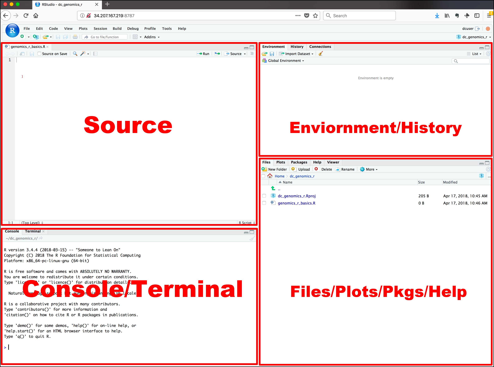

```{r setup, include=FALSE}
knitr::opts_chunk$set(echo = TRUE, cache = TRUE)
```

```{r echo=FALSE}

#  R Bootcamp #1, Module 1    
#      University of Nevada, Reno             

#  Getting started with R: the basics  -----------------------

```


## Get materials for this module

You will be introduced to a lot of new material very quickly in this workshop, and you are not expected to remember everything! 'Cheatsheets' can quickly and easily refresh your memory about syntax that can be difficult to remember. So don't worry if you don't memorize everything we do together in this workshop- the key is that you leave this workshop with comfort working in the RStudio environment, doing some basic data operations in R, and most importantly, learning and trying new things on your own!

Here are links to good R "cheatsheets":

### Base R
[Base R Cheat sheet](https://www.i3s.unice.fr/~malapert/R/pdf/base-r.pdf)        
[R reference card]()

### Helpful packages
[ggplot cheat sheet](https://raw.githubusercontent.com/rstudio/cheatsheets/main/data-visualization.pdf)       
[data 'tidying'](https://raw.githubusercontent.com/rstudio/cheatsheets/main/tidyr.pdf)    
[data transformation](https://raw.githubusercontent.com/rstudio/cheatsheets/main/data-transformation.pdf)        
[working with dates and times](https://raw.githubusercontent.com/rstudio/cheatsheets/main/lubridate.pdf)           

Many additional 'cheat sheets' are available [here](https://www.rstudio.com/resources/cheatsheets/)        

## Load script for submodule #1.1

1. Click [here](module1_1.R) to download the script for this submodule! I recommend right-clicking (or command-clicking for Macs) on the link and selecting the "Save As" option from the context menu. Save the script to a convenient folder on your laptop (e.g., a folder called "Rworkshop2023"), which will serve as your **working directory** for this workshop. 

2. Start a new **RStudio Project**. To do this, open RStudio and from the File menu select File>>New Project. In the menu that follows, select "Existing Directory", and then navigate to the folder in which you saved the R script for this module (your working directory). Select this folder to be your **project directory**. Every time you open this project (File >> Open Project), this project directory will be the first place that R looks for data files and code, and will be the default location for saving data and code.  

3. Load a blank script in RStudio. To do this, click on the "blank paper" icon at the far left of the RStudio toolbar (or File >> New File >> R script). Your RStudio interface should now be divided into four quadrants. In the RStudio default configuration, the top left panel is your **script** (a set of written commands that R can recognize and execute), the bottom left panel is your **console** (your direct connection with R), the top right panel is your **environment** (displays all the objects -- data sets, variables, functions-- that you have defined in your current R session), and the bottom right panel is a set of tabbed interfaces that let you view help files, load packages, view plots, view files in your working directory, etc. 

Take a couple minutes to familiarize yourself with the RStudio environment.

Let's get started!

{width=50%}

## Explore the R console

The R console is located in the left half or bottom left of the RStudio interface (see figure above).

The R console (what you see if you opened R directly instead of RStudio) is a **command line** interface, and is *your direct connection with R*: you give R a command at the prompt and R executes that command. 

1. Click on the console, just to the right of one of the ">" prompts.  

2. You can use the console like a calculator. For example, type `6+11` at the prompt and hit enter.

3. Now hit the "up" arrow. The R console remembers all previous commands that it has executed in this **session**, which allows you to re-run commands relatively easily.

4. Try typing `# 2+2` and hitting "Enter". Nothing happens, right? We will come back to the special hashtag character shortly.

### Let's create our first object

Objects are defined using R's **assignment operator** (Windows shortcut: Alt + -)(Mac: replace Alt with Option), which looks like a left arrow (`<-`). Type the following statement directly into the console:

```{r results=F}

myname <- "batman"  # or use your real name. Or maybe that IS your real name...

```

Then hit "Enter". What does R return? 

NOTHING! At least, nothing directly shows up in the console.

BUT.... check the **Environment** window (top right of RStudio interface- list of all the objects you've defined in this session). You should see that you now have a new **object** in your environment, called "myname", and this object contains a single **text string**. 
      
Now type `myname` into the R console and hit "Enter". What happens?

If you enter the name of an object at the command line, R automatically prints the value of the object!

NOTE: RStudio has a useful *autofill* feature, which can save you lots of time and headaches. After you've typed the first couple letters (e.g., "my"), RStudio will suggest "myname" (or use the "tab" key to trigger RStudio to give you autofill options) and you can just scroll to the right object/function and hit "Enter"! The autofill feature, unlike R, is not case sensitive!  

## Graduating to R Scripts

You will quickly realize that although the command-line R console is nice to use for some things (e.g., quick things that don't need to be saved), there is a much better way to develop R code. That is by storing a sequential set of commands as a text file. 

This text file (the standard is to use the ".R" extension) is called an **R script**. 

### Make a new script

If you haven't done it already, create a new R script by clicking on the "blank paper" icon at the far left of the RStudio toolbar (or File>>New File>>R script). The top left quadrant of the RStudio interface (the "Source" window) should now contain a blank R script. 

In your blank script, let's define a new object. For example:

```
my_obj <- 6+11

```

Now place the cursor somewhere within the line of text you just wrote and hit 'Ctrl+Enter' (or 'Command+Enter') to run that line of code! You should see a new object ('my_obj') pop up in your environment.[^shortcuts]. 

[^shortcuts]: RStudio has several helpful keyboard shortcuts to make running lines of code easier. [Check this website](https://support.rstudio.com/hc/en-us/articles/200711853-Keyboard-Shortcuts) for a comprehensive set of keyboard shortcuts- or access the shortcuts using help>>keyboard shortcuts.

Take a few minutes to get comfortable running commands and defining new objects using your new R script. 

Of course, it's always a good idea to save your scripts often -- so feel free to save your new script before you move on.

### Load an Existing script

Remember the file you downloaded at the beginning of this submodule? That file is an R script (["module1_1.R"](module1_1.R)); Let's load it up now! You can have multiple scripts open at the same time- they appear as tabs at the top of the script/source window.  

To do this, click on the "folder" icon on the Rstudio toolbar (or File >> Open File) and choose the script you downloaded earlier.

The first couple lines of the script for this module are preceded by hash marks. As you have already seen, R ignores these lines (anything preceded by a hash is ignored)- they are called **comments**, and they help to keep code organized and understandable. 

_use comments early and often- they are tremendously valuable_.   

Now you know the basics of how to use R scripts! Now, let's keep working through the remainder of the script you just opened. 

## R Objects

Okay, let's step back and learn a little bit about R as a data-oriented programming language. 

R has many different kinds of objects that you can define and store in memory. 

Objects that enable storage of information (data objects) include: *vectors*, *matrices*, *lists*, and *data frames*.

Objects that transform data and perform operations (e.g., statistics/visualizations) on data objects are called *functions*.

### Functions

Functions are routines that take inputs (usually data objects) (also called **arguments**) and produce something useful in return (transformed data objects, summaries, plots, tables, statistics, files). 

In R, the name of the function is followed by parentheses, and any arguments (inputs) are entered inside the parentheses. The basic syntax looks like the code snippet below.

{width=25%}

```
## function syntax
functionName([argument 1, argument2, ...])
```

If you don't type the parenthesis, the function is not run- instead, the function definition is shown instead. 

Here are some examples of how functions are used. Note the parentheses!

```{r results=F}

# BACK TO BASICS -------------------

# functions ------------------- 

sum(1, 2, 3, 10)    # returns: 15

c(1, 2, 3, 10)   # combine four numbers into a single data object (construct a vector!)

floor(67.8)  # removes the decimal component of a number
round(67.8)  # rounds a number to the nearest integer
```

```{r eval=F}

near(0.01,0,tol=0.2)  # returns TRUE if argument 1 is near to argument 2 within a certain tolerance level
```

Oops, that last one is not part of base R. It's actually part of an R package called 'dplyr'- one of the most commonly used packages in R ecosystem! A package is basically a set of functions that expand the capabilities of base R. Let's load 'dplyr', along with a whole bunch of packages known as the 'tidyverse'. We will also load a commonly used plotting package called 'ggplot2'. 

Using packages involved 2 steps:     
1. Install the package (you only need to do this once)    
2. Load the package (use the 'library()' function (you need to do this every time you start a new R session). 

```{r message=FALSE, warning=FALSE}

  # load 'tidyverse'  and 'ggplot'
library(ggplot2) 
library(tidyverse)
```

```{r eval=F}

near    # oops, forgot the parentheses!

near(1,1.1)
near(1,1.01)
near(1,1.000000001)

?near  # get some help on this function

```

It's easy to get some help if you forget how a function works:

```{r}

help(round)  # a function for getting help with functions!!
?round         # shortcut for the 'help' function

```

We will revisit functions in more detail (and build our own functions) in the "Programming" submodule.

### Data objects and variables

#### Data types

The basic data types in R are:

+ "numeric" (numbers)      
+ "character" (text strings)
+ "logical" (TRUE/FALSE)    
+ "factor" (categorical) 

Data of each of these types can be stored in several different types of objects. We will go through them in this order:

+ scalars
+ vectors
+ matrices
+ lists
+ data frames

#### Scalars

Scalars are the simplest data objects. A scalar is just a single value of any data type.

```{r results=F}


#  Create R Objects ------------------------


# scalars 


scalar1 <- 'this is a scalar'
scalar2 <- 104

```

Scalars can store information of any type [^typeof]. In the example above, `scalar1` is a character, `scalar2` is numeric. 

[^typeof]:If you're uncertain about the type of any R object the R function use the `typeof()` function.

#### Vectors

Vectors can combine multiple scalars in a single data object. 

First let's create some vectors. In the code below we use a function called `c()`. You can think of it as the 'combine' function- it takes several smaller data objects and combines them together into a single object. 

```{r}

# VECTORS  

vector1 <- c(1.1, 2.1, 3.1, 4)   # the "c()" function combines smaller data objects into a larger object
vector2 <- c('a', 'b', 'c')

```

There are many different ways to create a vector. You'll learn more about that later. Check out the vectors you just created. Each vector is composed of one or more scalar **elements** of the same type. 

Now let's do some stuff with vectors!

```{r results=F}

d1 <- 1:3             # make a vector: 1,2,3
d2 <- d1+3            # add 3 to all elements of the vector "myvec"
d3 <- d1+d2           # elementwise addition

length(d1)            # number of elements in a vector
sum(d3)               # sum of all elements in a vector

d2[2]                 # extract the second element in the vector

d2[2] <- 5            # change the second element in the vector

```

NOTE: strictly speaking, there are no true scalars in R- scalars are just vectors with 1 element!   

#### Matrices

**Matrix** data objects have two **dimensions**: rows and columns. All of the elements in a matrix must be of the same **type**. 

Let's make our first matrix. One simple way to make a matrix is just by joining two or more vectors using the function `cbind()` (bind vectors or matrices together by column) or `rbind()` (bind vectors or matrices together by row)

```{r}

# MATRICES 

mymat <- cbind(d1,d2)        # create a matrix by binding vectors, with vector d1 as column 1 and d2 as column 2
mymat
class(mymat)   # confirm that the new object "mymat" is a matrix using the 'class()' function

mymat <- matrix(c(1,2,3,4,5,6),nrow=3,ncol=2)        # create matrix another way (matrix constructor)
mymat

```


We can do stuff with matrices:

```{r}

# math with matrices

mymat + 2
sum(mymat)

# extract matrix elements

mymat[3,2]    # extract the element in the 3rd row, 2nd column

mymat[,1]     # extract the entire first column

# X[a,b]       access row a, column b element of matrix/data frame X
# X[,b]        access all rows of column b of matrix/data frame X
# X[a,]        access row a of matrix/data frame X

mymat[2,1] <- 10    # re-assign a new value to an element in a matrix

mymat[2,]  <- 5   # change all elements in a row!
 
```


#### Lists

**Lists** are more general than matrices. **List** objects are just a bunch of arbitrary R data objects (called **list elements**) grouped together into a single object! The elements of a list don't need to be the same length or the same **type**. The elements of a list can be vectors, matrices, other lists, or even functions.  

Let's make our first list:

```{r}

# LISTS 

mylist <- list()        # create empty list
mylist[[1]] <- c(1,2,3)     # note the double brackets- this is one way to reference list elements. 
mylist[[2]] <- c("foo","bar")
mylist[[3]] <- matrix(1:6,nrow=2)
mylist

# do stuff with lists

mylist[[2]]    # extract the second list element

mylist[[3]][1,2]   # extract the first row, second column from the matrix that is embedded as the third element in this list ! 

mylist[[3]][1,2]  <- 10  # re-assign a new value to an element of a matrix within a list!

```

##### Data frames and tibbles

**Data frame** objects are the basic data storage object in R. Data frames are a special type of **list** in which each list element is a *vector* of equal length. Each list element in a data frame is also known as a *column*. 

Data frames superficially resemble matrices, since both have rows and columns. However, unlike matrices, the columns of a data frame can represent different data **types** (i.e., character, logical, numeric, factor), and can thereby represent different types of information!  

_Data frames are the fundamental data storage structure in R_. You can think of a data frame like a spreadsheet. Each row of the the data frame represents a different observation, and each column represents a different measurement taken on each observation unit. 

Let's make our first data frame. 

```{r}

# DATA FRAMES 

df1 <- data.frame(col1=c(1,2,3),col2=c("A","A","B"))        # create a data frame with two columns. Each column is a vector of length 3
df1

df1[1,2]     # extract the first element in the second column
df1$col2     # extract the second column by name (alternatively, df1[["col2"]])

df1$col2[2]  <- 5   # reassign an element of a column of the data frame

df1$col2 <- 5   # reassign a whole column!

```

Now we have a data frame with three observation units and two measurements (variables).

A **tibble** is the same thing as a data frame, just with a few tweaks to make it work better in the tidyverse. We will work with both tibbles and data frames in this workshop. For our purposes, tibbles and data frames are the same thing.

## Making up data!

In this section, we will make up some fake data objects. In the next submodule we'll practice working with real data! 

### Generating sequences of numbers

One task that comes up a lot is generating sequences of numbers:

```{r}

# MAKING UP DATA!  ----------------------------------

# Generating vector sequences  

1:10                        # sequential vector from 1 to 10

seq(0,1,length=5)          # sequence of length 5 between 0 and 1 

```


Another task is to group regular recurring sequences together:

```{r}

# Repeating vector sequences 

rep(0,times=3)                # repeat 0 three times
rep(1:3,times=2)              # repeat the vector 1:3 twice
rep(1:3,each=2)               # repeat each element of 1:3 two times

```


And finally, we can fill up a vector with random numbers using one of R's built in **random number generators**:

```{r}

# Random numbers 

rnorm(10)                     # 10 samples from std. normal

rnorm(10,mean=-2,sd=4)        # 10 samples from Normal(-2,4^2)

rbinom(5,size=3,prob=.5)      # 5 samples from Binom(3,0.5)
rbinom(5,3,.1)                # 5 samples from Binom(3,0.1)

runif(10)                     # 10 standard uniform random numbers
runif(10,min=-1,max=1)        # 10 uniform random numbers from [-1,1]

```


And finally, we can make up a fake data frame (or tibble) using some of the tricks we just learned!

```{r}

# Make up an entire fake data frame!

my.data <- tibble(
  Obs.Id = 1:100,
  Treatment = rep(c("A","B","C","D","E"),each=20),
  Block = rep(1:20,times=5),
  Germination = rpois(100,lambda=rep(c(1,5,4,7,1),each=20)),   # random poisson variable
  AvgHeight = rnorm(100,mean=rep(c(10,30,31,25,35,7),each=20))
)
my.data
summary(my.data)    # Use the "summary()" function to summarize each column in the data frame.

mydf=my.data[21:30,]  # extract rows 21 to 30 and store as a new data frame
mydf

mydf$Treatment    # access a column of the data frame by name

```

Here are some useful R functions for exploring data objects:

```{r eval=FALSE}

# Useful data exploration/checking tools in R --------------------

length(d2)        # Obtain length (# elements) of vector d2
dim(mymat)        # Obtain dimensions of matrix or array
summary(my.data)  # summarize columns in a data frame. 
names(my.data)    # get names of variables in a data frame (or names of elements in a named vector)
nrow(my.data)     # get number of rows/observations in a data frame
ncol(my.data)     # get number of columns/variables in a data frame
str(my.data)      # look at the "internals" of an object (useful for making sense of complex objects!)

```


## Challenge exercises

1. Create a 3 row by 2 column matrix named 'mymat'. Use the "rbind()" function to bind the following three rows together using these three vectors as rows:

```
c(1,4) 
c(2,5) 
c(3,6)
```

Your final matrix should look like this:

```{r echo=FALSE}

rbind(
c(1,4),
c(2,5),
c(3,6)
)

```

2. Create a new matrix called 'mymat2' that includes all the data from columns 3 to 5 of data frame mydf. HINT: use the "as.matrix()" function to coerce a data frame into a matrix. 

Your result should look like this:

```{r echo=FALSE}

as.matrix(mydf[,3:5])

```


3. Create a list named 'mylist' that is composed of a vector: 1:3, a matrix: matrix(1:6,nrow=3,ncol=2), and a data frame: data.frame(x=c(1,2,3),y=c(TRUE,FALSE,TRUE),z=c("a","a","b")).

Your result should look like this:

```{r echo=FALSE}

mylist <- list()
mylist[[1]] <- 1:3
mylist[[2]] <- matrix(1:6,nrow=3,ncol=2)
mylist[[3]] <- data.frame(x=c(1,2,3),y=c(TRUE,FALSE,TRUE),z=c("a","a","b"))
mylist

```

4. Extract the first and third observation from the 2nd column of the data frame in 'mylist' (the list created in challenge 6 above). 

5. (optional- extra challenging!) Create a data frame (or tibble) named 'df_spatial' that contains 25 spatial locations, with 'long' and 'lat' as the column names (25 rows/observations, 2 columns/variables). These locations should describe a 5 by 5 regular grid with extent long: [-1,1] and lat: [-1,1]. 

HINT: you don't need to type each location in by hand! Use the 'rep()' and 'seq()' functions instead.

To make sure you got it right, use the visualization code provided below:

It should look something like this:

```{r echo=FALSE}

# challenge 5

x <- rep(seq(-1,1,length=5),each=5)
y <- rep(seq(-1,1,length=5),times=5)
df_spatial <- data.frame(long=x,lat=y)
plot(x=df_spatial$long, y=df_spatial$lat, main="Regular grid",xlab="long",ylab="lat",xlim=c(-1.5,1.5),ylim=c(-1.5,1.5),pch=20,cex=2)
abline(v=c(-1,1),h=c(-1,1),col="green",lwd=1)

```


```{r eval=FALSE}

# CHALLENGE EXERCISES -------------------------


### Challenge 1: Create a 3 row by 2 column matrix equivalent to mymat. Use the "rbind()" function to bind the three rows together using the following three vectors as rows:

c(1,4) 
c(2,5) 
c(3,6)

### Challenge 2: Create a new matrix called 'mymat2' that includes all the data from columns 3 to 5 of data frame mydf. HINT: use the "as.matrix()" function to coerce a data frame into a matrix.

### Challenge 3: Create a list named 'mylist' that is composed of a vector: 1:3, a matrix: matrix(1:6,nrow=3,ncol=2), and a data frame: data.frame(x=c(1,2,3),y=c(TRUE,FALSE,TRUE),z=c("a","a","b")).

### Challenge 4: Extract the first and third observation from the 2nd column of the data frame in 'mylist' (the list created in challenge 6 above).

### Challenge 5: (optional; extra challenging!) Create a data frame named 'df_spatial' that contains 25 spatial locations, with 'long' and 'lat' as the column names (25 rows/observations, 2 columns/variables). These locations should describe a 5 by 5 regular grid with extent long: [-1,1] and lat: [-1,1]. 

###     HINT: you don't need to type each location in by hand! Use the 'rep()' and 'seq()' functions instead.

# Code for visualizing the results from challenge problem 5:

plot(x=df_spatial$long, y=df_spatial$lat, main="Regular grid",xlab="long",ylab="lat",xlim=c(-1.5,1.5),ylim=c(-1.5,1.5),pch=20,cex=2)
abline(v=c(-1,1),h=c(-1,1),col="green",lwd=1)

```


```{r echo=FALSE, results=FALSE, eval=FALSE}

# Module 1_1 challenge problems: answers  -------------


### Challenge 1: Create a 3 row by 2 column matrix named "mymat". Use the "rbind()" function to bind the following three rows together using these three vectors as rows:

mymat <- rbind(
c(1,4),
c(2,5),
c(3,6)
)

### Challenge 2: Create a new matrix called 'mymat2' that includes all the data from columns 3 to 5 of data frame mydf. HINT: use the "as.matrix()" function to coerce a data frame into a matrix.

mymat2 <- as.matrix(mydf[,3:5])

### Challenge 3: Create a list named 'mylist' that is composed of a vector: 1:3, a matrix: matrix(1:6,nrow=3,ncol=2), and a data frame: data.frame(x=c(1,2,3),y=c(TRUE,FALSE,TRUE),z=c("a","a","b")).

mylist <- list()
mylist[[1]] <- 1:3
mylist[[2]] <- matrix(1:6,nrow=3,ncol=2)
mylist[[3]] <- data.frame(x=c(1,2,3),y=c(TRUE,FALSE,TRUE),z=c("a","a","b"))

### Challenge 4: Extract the first and third observation from the 2nd column of the data frame in 'mylist' (the list created in challenge 6 above).

mylist[[3]][[2]][c(1,3)]


### Challenge 5: (optional, extra challenging!) Create a data frame named 'df_spatial' that contains 25 spatial locations, with 'long' and 'lat' as the column names (25 rows/observations, 2 columns/variables). These locations should describe a 5 by 5 regular grid with extent long: [-1,1] and lat: [-1,1]. 

# challenge 5

x <- rep(seq(-1,1,length=5),each=5)
y <- rep(seq(-1,1,length=5),times=5)
df_spatial <- data.frame(long=x,lat=y)
plot(x=df_spatial$long, y=df_spatial$lat, main="Regular grid",xlab="long",ylab="lat",xlim=c(-1.5,1.5),ylim=c(-1.5,1.5),pch=20,cex=2)
abline(v=c(-1,1),h=c(-1,1),col="green",lwd=1)

```


```{r echo=FALSE,results=FALSE, eval=FALSE}


```


[--go to next submodule--](module1_2.html)


