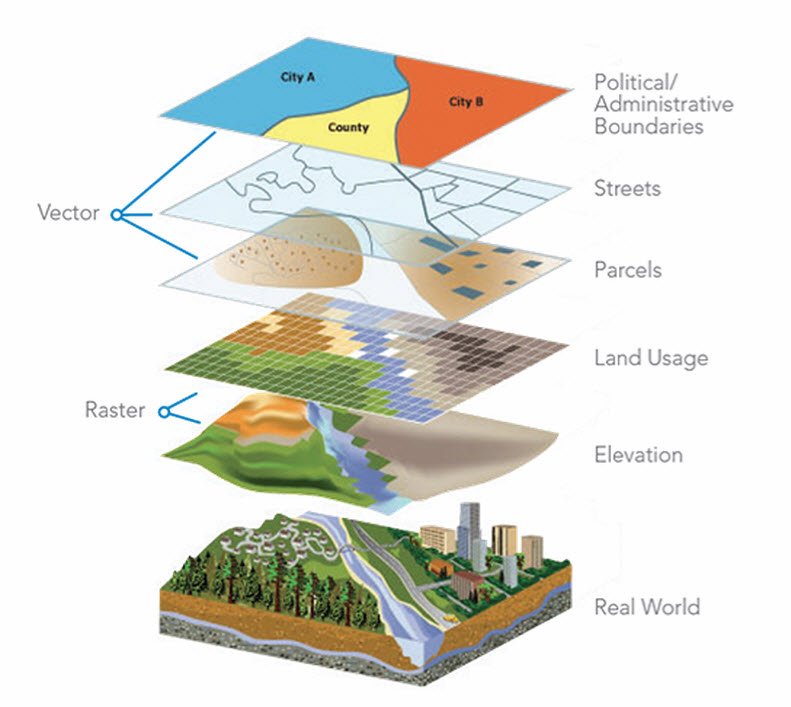
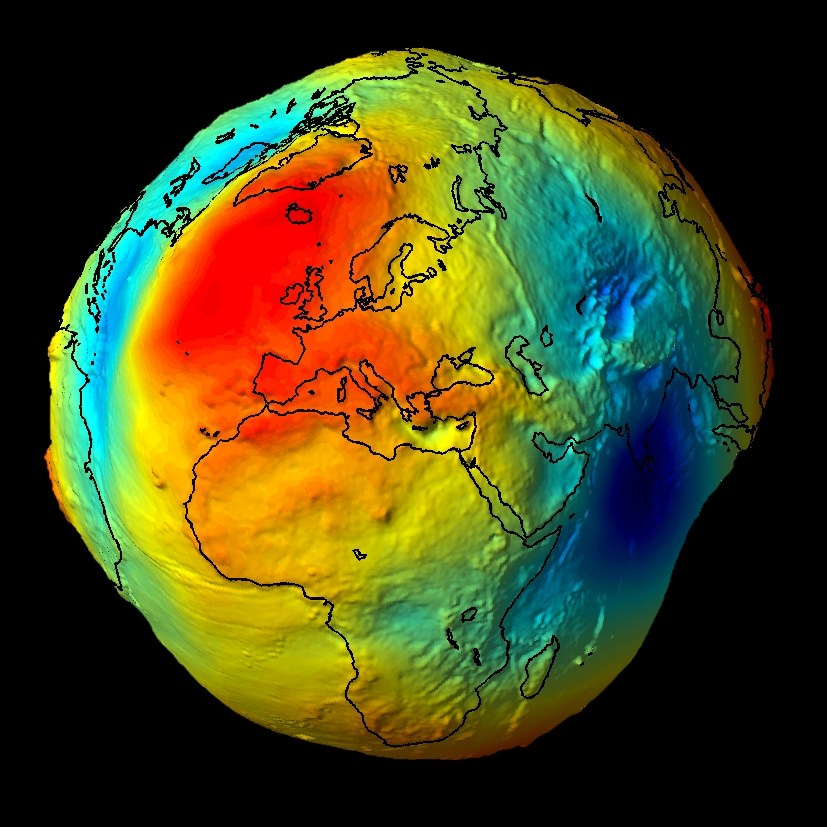
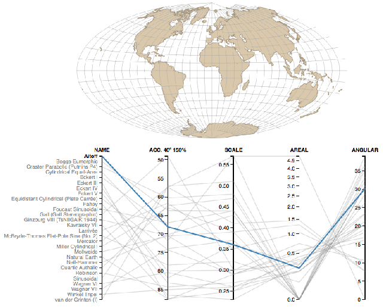

```{r setup, include=FALSE}
knitr::opts_chunk$set(echo = TRUE, cache = TRUE)
```

```{r echo=FALSE}

##################################################
####                                          ####  
####  R Bootcamp, Module 2.6                  ####
####                                          #### 
####   University of Nevada, Reno             ####
####                                          #### 
##################################################


######################################################
####  Introduction to Spatial Data Analysis in R  ####
####     Facilitator: Mitch Gritts                ####
######################################################

```

**Guest presenter**: Mitch Gritts (who also pulled this module together!)

## Load script for module 2.6

1. Click [here](module2_6.R) to download the script! Save the script to a convenient folder on your laptop.

2. Load your script in RStudio. To do this, open RStudio and click on the folder icon in the toolbar at the top and load your script. 

Let's get started with spatial data in R!

## The Science of Where

Spatial analysis allows you to solve complex location-oriented problems and better understand where and what is occurring in your world. It goes beyond mere mapping to let you study the characteristics of places and the relationships between them.

<div style="margin: 16px 0">
  
  <figcaption class="figure-caption" style="color:grey; margin-left:30px; margin-right:30px; margin-top:8px; font-style:italic;">Spatial data analysis combines several different data types and methods in an attempt to model the real world.</figcaption>
</div>

## Spatial isn't Special (in R)

Spatial data, just like all other data in R, are combinations of vectors, matrices, and lists. These combinations of data are wrapped into specialized classes, and have many specialized methods to make working with them easier. Most of the functionality comes from the `sp` package for vector data, and `raster` package for raster data. In addition to these packages we will use a few other packages:

1. `rgdal` - an R wrapper to the open source [gdal library](https://www.gdal.org/)
2. `rgeos` - an R wrapper to the open source [geos library](http://trac.osgeo.org/geos)
4. `leaflet` - an R wrapper to the javascript library 'leaflet' for interactive maps

```{r message=FALSE}

###################
# before starting make sure we have a clean global environment
rm(list = ls())

# load libraries and set working directory
library(dplyr)
library(spData)
library(sf)
library(raster)
library(rgdal)
library(rgeos)
library(rcartocolor)
library(magrittr)
library(leaflet)

```

*Check the footnotes for info about some of the warnings* [^1]

[^1]: The `raster` and `dplyr` libraries each have a function called `select`. I prefer to load `dplyr` first and have the `raster` library mask the `select` function in the `dplyr` library. In order to call the `select` function in the `raster` library we need to explicitly reference the library we want to use with two colons: `dplyr::select`. When using double colons the libraries namespace (list of functions, variable, etc.) is loaded, but not attached to the session. This allows us to call function from libraries we haven't explicitly loaded with `library()` or `requrie()` function. I have a tendancy to (over)use this method. It is very helpful when writing your own functions and libraries as those functions will not throw errors about a library not being loaded.

## Spatial Data

> Everything is related to everything else, but near things are more related than distant things
<p class="display-block text-right"><small>Waldo Tobler, <em>Tobler's first law of geography</em></small></p>

There are two ways to model geographic data: as vectors or rasters. In the sections that follow we will first review vector data, then raster data. First we will review the theory behind each model then demonstrate how to implement them in R

### Vector Data

Vector [^vector] data represents the world as points with a geographic refence (they are somewhere on the earth). These points can be linked together to form more complex geometries such as lines and polygons.

[^vector]: In a spatial context the definition of vector is different than a how R refers to a vector. It is important to distinguish the two based on context. In this module I will almost always be refering to the geographic data .

#### Points

Points represent single features, such as a tree in a forest or a location of an captured animal. Points are pairs of (x, y) coordinates. Points are often 2 dimensions, however they can be extended with a z value to represent height above sea level. Attribute data can be attached to each point. An example of points with attribute data might be trees in a forest, and the attributes are height, diameter, species, etc.

#### Lines

Lines are a bit more complex. They are composed of many vertices (points) that are ordered and connected. Each line can also have data associated with it. Roads or rivers are great examples, and might have data like width, speed limit, flow as attribute data.

In R lines can be one or more line objects. For instance, the Truckee River and all its tributaries can be a single lines (multi-line) object, composed of many line objects for each of the tributaries.

#### Polygons

A polygon is a set of closed lines. It is very similar to lines, however the first vertex must also be the last vertex in order to close the polygon. Polygons can have holes in them, think an island in a lake, which is a polygon enclosed inside another polygon. And just like lines, multiple polygon objects can make up a single polygons (multi-polygons) object. For instance, a chain of islands. Each island is a single polygon. Together all the individual island polygons represent the entire island chain polygon (multi-polygon). 

I find polygons easier to think about, so in the examples below I will first review points, then polygons, then lines.

### Raster

Raster data divides an area of interest into a grid to represent continuous (and sometimes discrete) data such as elevation. The grid has equally sized rectangular cells (or pixels) that can have one or more values (multi-band rasters). The size of the cells is refered to as the resolution of the grid, smaller cell sizes are higher resolution. The value of that cell generally represent the average value for the area that cell covers. However, the value of each cell can represent the maximum or minimum value as well. If this is the case, the data provider will reference the cell values in a metadata document (hopefully).

Raster data is represented by a matrix of the spatial extent we are interested in. So if we have a 1km square area of interest with a 1 meter resoltion we have 1000 x 1000 matrix, each element of that matrix representing the value of a variable for that 1 meter cell.

We will likely not have much time to cover raster data because of our limited time together, and the amount of time loading and working with raster can take. I'll provide a few short examples at the end to run on your own.  

## Coordinate Reference Systems

<div style="margin: 16px 0">
  
  <figcaption class="figure-caption" style="color:grey; margin-left:30px; margin-right:30px; margin-top:8px; font-style:italic;">This figure depicts one of the most accurate representations of the shape of the earth, or geoid.</figcaption>
</div>

An important component all spatial objects share is a coordinate refernece system (CRS). A CRS defines how the spatial elements of the data relate to the surface of the Earth. CRSs are either geographic or projected. 

CRSs are a very important concept in spatial data (maybe the most important?). I'll go into detail below as a reference, however we will not have enought time to cover this topic in detail. 

### Geographic Coordinate Systems

Geographic coordinate system: identify any location on the Earth using *longitude* and *latitude*. These are measures of the angular distance from the Prime Meridian or equatorial plane (for longitude and latitude, respectively). Distances in Geographic CRSs are measured in degrees, minutes, and seconds (or other angular unit of measurement). 

Geographic CRSs will make some assumptions to model the shape of the earth. As stated above, the surface of the earth isn't a perfect sphere or ellipse. Spherical models assume that the earth is a perfect sphere. These models are simple but rarely used because of the amount of inaccuracy in them. Ellipsoidal models are a more accurate model of the Earth. They are defined by an equatorial radius and polar radius.

### Projected Coordinate Systems

Projected coordinate system: based on Cartesian coordinates on a flat surface. They have an origin, x and y axes. These rely on map projections to convert the three dimensional shape surface of the earth into Easting and Northing (x and y) in the projected CRS. Easting and Northing of a point are measures of distance from the axes as defined in the CRS. Distances in projected CRSs are linear units of measurement such as meters. 

The projection from an ellipsoid to a plane cannot be done without distorting some of the properties of the Earth's surface. In most cases one or two of the following properties are distorted: area, direction, shape, distance. Projections are often named based on the properties the accurately maintain: equal-area maintains area, azimuthal maintains direction, equidistant maintains distance, and conformal maintains local shape.

<div style="margin: 16px 0">
  
  <figcaption class="figure-caption" style="color:grey; margin-left:30px; margin-right:30px; margin-top:8px; font-style:italic;">Watch how the representation of the earth changes as the projections change</figcaption>
</div>

There are several methods to add a projection to `sf` and `raster` objects. The underlying structure of a projection string is from the [PROJ.4 open source library](https://proj4.org/). These are often refered to as a coordinate reference system (CRS). A common shorthand for creating CRSs is to use an EPSG id[^2].

Below is a list of common projections:

1. WGS84 ([EPSG:4326](epsg.io/4326)) - Latlong used in GPS systems
2. Pseudo-Mercator ([EPSG:3857](epsg.io/3857)) - Used in web maps
3. NAD83 zone 11n ([EPSG:26911](epsg.io/26911)) - North America metric based, Nevada. Can be used across zone lines, however accuracy suffers, especially further North
4. NAD27 zone 11n ([EPSG:26711](epsg.io/26711)) - Old, replaced by NAD83. Works best within zone lines. Don't use this, convert old data to NAD83.
5. Albers Equal-area Conic ([EPSG:102003](epsg.io/102003)) - Used by the USGS and US Census

[^2]: The European Petroleum Survey Group maintains a list of IDs to all the projection systems. These are a nice shorthand for create coordinate reference strings in R. [epsg.io](epsg.io) is a great interactive site to discover EPSG IDs.

Coordinate reference systems are confusing, and I have a super difficult time understanding them sometimes. [Here is a super helpful reference](https://www.axismaps.com/guide/general/map-projections/).

## Spatial Objects

In 2005 Edzer Pebesma and Roger Bivand cretaed the `sp` package to handle spatial data in R. `sp` provides a set of classes and methods for vector and raster data types. At the time, there weren't many agreed upon standards for spatial data. In 2004 the Open Geospatial Consortium published a formal international standard for spatial data called *simple feature access*. It was originaly developed for SQL, and has since been adopted by many spatial communities (ESRI, QGIS, Postgres). 

Over the last year Pebesma et al. are actively developing a new package to handle spatial data in R. It is called `sf` for simple feature.

### Introduction to simple features

At the core `sf` extends the `data.frame` class to include a geometry column. This geometry column can be of several types (found within the simple feature standard): `POINT`, `LINE`, `POLYGON`, ...etc.

The major classes in the `sf` package are:

* `sf`: a `data.frame` with a spatial attribute
* `sfc`: a column storing the all the geometries for different records of a `data.frame`
* `sfg`: a geometry of each individual record.

Let's dig into the details of spatial data with `sf` in the sections below.

### sf geometry types

As mentioned above, `sf` has many different types of geometries. Let's create a few simple geometries so that we have an idea of what they are. These (class `sfg`) are the basic building blocks of all the classes in the `sf` package.

```{r sf_intro, results=F}

## a single point
st_point(c(1, 1))

## multiple points 
st_multipoint(rbind(c(0, 0), c(1, 0), c(1, 1), c(0, 1), c(0, 0)))

## a line
st_linestring(rbind(c(0, 0), c(1, 0), c(1, 1), c(0, 1), c(0, 0)))

## a polygon
st_polygon(list(rbind(c(0, 0), c(1, 0), c(1, 1), c(0, 1), c(0, 0))))

## ...etc

```

A comprehensive overview of all the geometry classes can be [found here](https://r-spatial.github.io/sf/articles/sf1.html)

### Creating Spatial Points Data

Let's start out by creating a `sf` object. 

First, download the following data set and save to your working directory: [reptiles.csv](reptiles.csv)

```{r create_sf_points, message=FALSE}

# create spatial points data frame ----
## load reptile data 
reptiles <- readr::read_csv('reptiles.csv')

## create a SpatialPoints object
sf_points <- st_as_sf(x = reptiles, 
                      coords = c('x', 'y'), 
                      crs = '+init=epsg:26911')

## inspect the SpatialPoints object
str(sf_points)

```

We used the `st_as_sf` function to create an object of class `sf`. The first parameter in the function call is `x`, which is the object to be converted to class `sf`. This should be a `data.frame` like object. The second parameter, `coords`, are the names of the coordiante fields in the object supplied to `x`, given as a vector. The final parameter, `crs`, is the coordinate reference system. This data was collected using NAD83 zone 11, so we used the EPSG ID (26911) to specify the projection.

Let's review the structure and summary data of this `sf` object. 

```{r st_crs, eval = F}

# inspecting the sf object ----
## checking the projection of the sf object 
st_crs(sf_points)

## summary funciton
summary(sf_points)

## what type is the geometry column
class(sf_points$geometry)

```


#### Subset sf object

```{r sf_head}
head(sf_points)
```

As you can see, this does look like a normal `data.frame` with a geometry column. In this case the geometry is a point, as shown by a coordinate pair. Just like `data.frames` we can use indexing to subset the data. One of the columns is species. Lets use this column to subset the data frame for only desert horned lizards (**Phrynosoma platyrhinos*).

```{r subset_spdf}

# subset an sf object ----
phpl <- sf_points[sf_points$species == 'Phrynosoma platyrhinos', ]
head(phpl)

## check to see that there is only one species in the data.frame
phpl %>% magrittr::extract2('species') %>% unique()

```

If you check the class of `sf_points` you'll see a list of different classes. `sf_points` is an object of class `sf`. But it inherits properties of the `tbl_df`, `tbl`, and `data.frame` class. That means that any methods that work on these classes will also work on objects of class `sf`. 

```{r sf with dplyr}

## we can filter using dplyr syntax
sf_points %>% 
  dplyr::filter(species == 'Phrynosoma platyrhinos') %>% 
  head()

```

Finally, let's plot this data. The plot function provided by `sf` behaves slightly differently than it does for most other classes. It'll create a plot for each attribute column in the `sf` object. 

```{r plotting with sf}

## plot with sf::plot
plot(head(sf_points, n = 100))

```

If you want to plot just a single variable, you must use the following syntax.

```{r plot with sf 2}

plot(head(sf_points['year'], n = 100))

## the plot function also uses this syntax to select a single row to plot
## plot(head(sf_points['year'], n = 100))

## and if you don't want to color the plot by feature you can use 0
## to specify plotting 0 attributes
## note, this is plotting all the points
plot(sf_points[0], col = 'purple')
```


### Loading Spatial Data

It is possible to create polygons from scratch in R. It takes a bit of work, and I'll provide an example later for reference. Most of the time you will not need to do this. Instead you will likely load data from a shapefile. In the code example below we are going to load county polygons for the state of Nevada. Like everything in R there are multiple methods to read shapefiles. Since we are using the `sf` package we'll use the functions provided in that package.

NOTE: for the next examples you will need to use GIS files that are stored in the following compressed data directory: [GIS data for module 2.6](data.zip). If you want to follow along, please download this file and unzip it in your working directory. Make sure the folder called "data" (that contains subdirectories called "nv_counties" and "roads") is in now in your working directory. 


```{r read_shapefile, message=FALSE}

#############
# Nevada Counties example...

# read in nv county shapefile ----
counties <- st_read(dsn = 'data/nv_counties/NV_Admin_Counties.shp')


## once finished check the structure
str(counties, max.level = 3)

## some data management
### check the contents of the geometry field
counties$geometry

### let's double check that projection of the counties
st_crs(counties)

### How does this projection compare to the sf_points object?
### double check the sf_points projection
st_crs(sf_points)

### then explicitly compare them using boolean logic
st_crs(counties) == st_crs(sf_points)

### let's reproject the points to our desired CRS, utm
### we will go into more detail on reprojections later
counties <- st_transform(counties, st_crs(sf_points))

### double check they are equal
st_crs(counties) == st_crs(sf_points)

```

`counties`, just like `sf_points`, is an object of class `sf`, which is extends the `data.frame` class. The difference is that the `counties$geometry` column is of a different vector type, in this case the type is `POLYGON`

```{r check_polygons, eval = F}

## check structure of a polygon within a SpatialPolygonsDataFrame
str(counties)

## check the geometry type
class(counties$geometry)

## print the first few rows for inspection
head(counties, n = 4)

```

Plotting polygons uses the same methods as plotting points. 

```{r plotting_spatial_polygon_1}

## plot a spatial polygon
plot(counties)

## we don't wan't to color by any feature
## st_geometry returns just the geometry column
plot(st_geometry(counties))

## we can plot certain polygons...
## which has a plotting behavior we aren't used to
## this will plot every attribute for the first county
plot(counties[1, ])

## if we only want to include the outline, the following will work
plot(st_geometry(counties)[1])

## multiple at once
layout(matrix(1:3, ncol = 3, nrow = 1))
plot(st_geometry(counties)[1])
plot(st_geometry(counties)[1:4])
plot(st_geometry(counties)[counties$CNTYNAME == 'Clark'])


## we can even plot our reptile points ontop of the counties
layout(matrix(1))
plot(st_geometry(counties))
plot(st_geometry(sf_points), pch = 1, cex = .5, col = 'purple', add = TRUE)

```

## GIS Operations

### Spatial Joins

Spatial data joining relies on shared geographic space. Joining two spatial objects results in a new object with the columns of the two joined spatial objects. This operation is also known as a spatial overly. The term spatial overlay might do a better job defining what the operation does. We overlay one spatial object over a second spatial object and ask the question, "For each item in the first geometry, what data in the second geometry is underneath it". 

The `sf` package has a function called `st_join()` that will perform the join. The function usage is as follows, `st_join(x, y)` where `x` is the first `sf` object and `y` is the second `sf` object.

The `st_join` function isn't limited to points and polygons, it can be run with lines and points, lines and lines, polygons and polygons, and lines and polygons. The code chunk below runs a spatial join for point and polygon geometries.

```{r spatial_joins} 

# Spatial joins ----

## use the %over% funcstion, which is the same as over(spdf_points, counties)
rslt <- st_join(sf_points, counties)

## what does rslt look like?
str(rslt)

## how about summary
summary(rslt)

```

`rslt` is an `sf` object with 60,955 observations of 13 columns (all the columns of each `sf` object in the functino call). If you look at `sf_points` there are 60,955 elements, and `rslt` has 60,955 elements, this is a good sign! To reiterate `st_join()` has taken each point in our first geometry, `sf_points`, and looked at the polygons in `counties` to see which polygon that point lies within, then binds those colunns together to make a new `sf` object. 

Notice that the geometry column for of `rslt` is still a `POINT`. What does happens if you switch the order of `sf_points` and `counties`? Run the code chunk below to find out.

```{r st_join_reverse, eval = F}

## what happens if you change the order of the input objects?
summary(st_join(counties, sf_points))

```

### Spatial Unions

Spatial unions (or aggregation) can dissolve the boundaries of geometries that are touching. This is a common operation if you are trying to create a boundary of multiple polygons

```{r unions}

# unioning polygons ----
## all of these function come from the rgeos package.
## select two counties to union
plot(st_geometry(counties)[2:3])

## union them
plot(st_union(st_geometry(counties)[2:3]))

# union all interior polygons ----
## we ccan do the same thing to get a the border of NV
## the following uses the pipe (%>%) to increase code readability
nv <- counties %>% st_geometry() %>% st_union()
plot(nv)

```

### Topological relations

Topological relations describe the spatial relationship between objects. That is, whether sets of spatial objects are within, outside, touching, or intersecting eachother. The example below will help illustrate that point.

```{r topological relations}
# topological relations ----

# create a polygon
a_poly = st_polygon(list(rbind(c(-1, -1), c(1, -1), c(1, 1), c(-1, -1))))
a = st_sfc(a_poly)
# create a line
l_line = st_linestring(x = matrix(c(-1, -1, -0.5, 1), ncol = 2))
l = st_sfc(l_line)
# create points
p_matrix = matrix(c(0.5, 1, -1, 0, 0, 1, 0.5, 1), ncol = 2)
p_multi = st_multipoint(x = p_matrix)
p = st_cast(st_sfc(p_multi), "POINT")

## plot
par(pty = "s")
plot(a, border = "red", col = "gray", axes = TRUE)
plot(l, add = TRUE)
plot(p, add = TRUE, lab = 1:4)
text(p_matrix[, 1] + 0.04, p_matrix[, 2] - 0.06, 1:4, cex = 1.3)
```

In the plot above there are several points (1 - 4), each with a certain spatial relationship to the triangle polygon. 

Point 1 (`p[1]`) is with the polygon (`a`), we can check with the following code:

```{r point1}
st_within(p[1], a, sparse = F)
```

However, point 2 (`p[2]`) isn't within the polygon, instead, it is touching the polygon.

```{r point2}
st_within(p[2], a, sparse = F)
st_touches(p[2], a, sparse = F)
```

Both points do intersect polygon a:

```{r point1 point2}
st_intersects(p[1:2], a, sparse = F)
```

And points 3 and 4 (`p[3:4]`) don't intersect the polgyon.

```{r points3-4}
st_intersects(p[3:4], a, sparse = F)
```

The same operations can be performed with the line (`l`), or even with points. The `sparse = F` tells the function to return a boolean matrix rather than a sparse matrix of 1's and 0's. For analysis I recommend using the default `sparse = T` due to the smaller footprint.

#### Points outside NV

Now that we have a basic understanding of some spatial operations, and the topological relationships between geometries we can get rid of all the points in `sf_points` that are outside of Nevada (see the map below).

```{r remove points, echo = F}

# remove points outside nv ----
plot(nv)
plot(st_geometry(sf_points), col = 'purple', add = T)

```

```{r remove points outside nv}

# remove points outside
sparse <- st_intersects(rslt, nv)
sel_logical <- lengths(sparse) > 0

sf_points <- rslt[sel_logical, ]

## check the results by uncommenting this code, and running
# plot(nv)
# plot(st_geometry(sf_points), col = 'purple', add = T)

```

We will use this `sf_points` object for the rest of the module, so make sure you get the correct result.

### Reproject

Spatial data is often read into the R session with a coordinate reference system (CRS) defined by the maintainers of the data set. When reading shapefiles with the `st_read()` function, the `.prj` file specifies a CRS of the data. In some cases, where you are creating the data yourself, such as the reptile data we loaded earlier, we need to know what CRS the data is being collected in. These settings can be changed in handheld GPSs. If the coordinates are in a combination of degrees, minutes, seconds the CRS is WGS84, a geographic coordinate system with an EPSG ID of 4326. In Nevada, if the coordinates are in meters then it is likely NAD83 zone 11. The zone is important as you'll see below.

In order to convert coordinates from one CRS to another we use the `st_transform()` function and provide the CRS we want to reproject the data into. Below we will use a dataset from `spData` that is an `sf` object of the contiguous US. The data is originally in EPSG 4269. We will convert this to WGS84.

```{r reproject}

# spTranform ----
## we will use a data set from the spData package
## the epsg id for this data is 4269
us_states <- spData::us_states

## check the CRS
st_crs(us_states)

plot(st_geometry(us_states), 
     col = 'white',
     graticule = st_crs(us_states), 
     axes = T, main = 'Initial, EPSG = 4269')

## reproject basics, and replot
wgs_usa <- st_transform(us_states, crs = '+init=epsg:4326')
plot(st_geometry(wgs_usa), 
     col = 'white',
     graticule = st_crs(wgs_usa), 
     axes = T, main = 'WGS84')

```

There are many, many different CRSs to choose from. Ultimately, the most important apsect of CRSs (and spatial data) is that we document the CRS of our data. Without a CRS we can't plot our points onto Earth. So please, do everyone a favor and document your data's CRS.

Below is a figure demonstrating how the shape of Nevada counties change depending on the projection. You can find a list of all these projections, and many more, at the [PROJ4 website](https://proj4.org/operations/projections/index.html).

```{r many_projections}

## we can do this with other reprojections as well so you can really tell a difference
layout(matrix(1:8, nrow = 2))
us_states %>% st_geometry() %>% 
  st_transform(crs = '+proj=aea') %>% 
  plot(col = 'white', 
       graticule = st_crs(wgs_usa),
       axes = T, main = 'Albers Equal Area')
us_states %>% st_geometry() %>% 
  st_transform(crs = '+proj=sinu') %>% 
  plot(col = 'white', 
       graticule = st_crs(wgs_usa),
       axes = T, main = 'Van Der Grinten')
us_states %>% st_geometry() %>% 
  st_transform(crs = '+proj=robin') %>% 
  plot(col = 'white', 
       graticule = st_crs(wgs_usa),
       axes = T, main = 'Robinson')
us_states %>% st_geometry() %>% 
  st_transform(crs = '+proj=gall') %>% 
  plot(col = 'white', 
       graticule = st_crs(wgs_usa),
       axes = T, main = 'Gall-Peters')
us_states %>% st_geometry() %>% 
  st_transform(crs = '+proj=eqc') %>% 
  plot(col = 'white', 
       graticule = st_crs(wgs_usa),
       axes = T, main = 'Plate Carree')
us_states %>% st_geometry() %>% 
  st_transform(crs = '+proj=goode') %>% 
  plot(col = 'white', 
       graticule = st_crs(wgs_usa),
       axes = T, main = 'Goode Homolosine')
us_states %>% st_geometry() %>% 
  st_transform(crs = '+init=epsg:26911') %>% 
  plot(col = 'white', 
       graticule = st_crs(wgs_usa),
       axes = T, main = 'NAD83 Zone 11')
us_states %>% st_geometry() %>% 
  st_transform(crs = '+init=epsg:26921') %>% 
  plot(col = 'white', 
       graticule = st_crs(wgs_usa),
       axes = T, main = 'NAD83 Zone 21')

```

The code above relies on predefined CRSs, hence the `+proj=...` statement. Some of these look really bad for plotting the US. These are due to how the CRS is created. Some are conic (Earth's geoid is projected onto a cone), others are cylindrical (projected onto a cylinder). Each has consequences for the distortion in the resulting maps. PROJ4 strings take a number of other parameters that define how the cone or cylinder are aligned for the projection. Below we will define our own CRS using the [Lambert conformal conic projection](https://en.wikipedia.org/wiki/Lambert_conformal_conic_projection).

```{r lcc_proj}

## we can also define our own projection
layout(matrix(1:2, nrow = 2))

us_states %>% st_geometry() %>% 
  st_transform(crs = '+proj=lcc') %>% 
  plot(col = 'white',
       graticule = st_crs(wgs_usa),
       axes = T, main = 'Lambert Conformal Standard')

us_states %>% st_geometry() %>% 
  st_transform(crs = '+proj=lcc +lat_1=33 +lat_2=45 +lat_0=39 +lon_0=-96 +x_0=0 +y_0=0 +ellps=GRS80 +datum=NAD83 +units=m +no_defs') %>% 
  plot(col = 'white',
       graticule = st_crs(wgs_usa),
       axes = T, main = 'Lambert Conformal USA')

```

The map on the left shows the standard Lambert projection, while the map on the right shows the Lambert projections with the standard parallels set to show a good representation of the US.

## Raster Data

You will almost always read raster data from external files. There are many different file types to store raster data. The most common is probably .tif, or .geotiff. R has a native raster format that is very compact with an extension .grd & .gri (there are two files). We will use this format to read in raster data.

```{r rasters}

# working with raster data ----
## save some data for later
save(counties, sf_points, rslt, nv, file = 'data/module2_6.RData')

## let's clean our workspace first
rm(list = ls())
load('data/module2_6.RData')

## load a raster
dem <- raster('data/nv_dem_coarse.grd')

## check dem structure
str(dem)

## what is this?
dem@data@inmemory

```

Wow, that is a lot of data packed into a single class[^slots]. Check that last command. What does that mean? Well, the Raster package cleverly keeps raster data saved in on disk, in a temporary file, rather than loading it into memory. This is a very nice feature because raster data can be huge. Don't let anyone tell you differently, geographic data was the first big data!

[^slots]: R supports two different class types, S3 classes and S4 classes. All we really need to now about them right now is how they differ in terms of accessing values. The `@` symbol is analogous to the `$` symbol for lists. It access named items from an S4 class. These items in S4 classes are called slots.

How about plotting the data? We have two different methods, `plot` and `image`. The essentially do the same thing. Pick your favorite.

```{r plot a raster}

## plot raster
terrain_colors <- rcartocolor::carto_pal(7, 'TealRose')
plot(dem)

## or, with a new set of more aesthetic colors!
image(dem, asp = 1, col = terrain_colors)

```

Let's load a second raster. This next one represents major roads in Nevada (from the Census TIGER dataset). I've converted the data from a `LINES` object to a `raster` so that we can do some computations with it. The plot below looks like a road network. If you look closely down near Las Vegas you'll see some darker green colors. Those cells are all the roads and highways lumped together in a single raster cell. The value of each cell in this data is the number of roads in that cell.

```{r distance to roads raster}

# load a second raster, distance to roads ----
road_rast <- raster('data/road_dist.grd')

## plot
plot(road_rast, col = rcartocolor::carto_pal(7, 'Mint'))
```

Check the projection on our Raster objects. The rasters we just loaded should be the same. What about when we compare it to `nv`? This is one of those instances, again, where the datasets are using the same coordinate reference system, however two different methods have been used to apply that coordinate reference system to the data. To prove they are the same coordinate reference system, we can plot the state border over the dem raster. 

```{r check raster projection}

## use the raster::projection function
projection(road_rast)
projection(dem)
identicalCRS(road_rast, dem)

## compare to nv SpatialPolygonsDataFrame
identicalCRS(dem, as(nv, 'Spatial'))

## proof these are the same crs
plot(dem, col = terrain_colors)
plot(nv, lwd = 3, add = T)

```

If we wanted to reproject the raster into a different coordinate reference system we would use the `raster::projectRaster` function. One of the parameters for this function is `filename`. This parameter allows you to give the function a filename so that data is saved onto disk as the operation progresses, rather than saving it in memory. Most of the time you should specify a filename when working with rasters.

### sp vs. sf

The `sf` package is very new. The first version was published on Jan 5, 2017. This means that not all packages play nicely with `sf`, yet. The `raster` package is an example. The core functions in `raster` can take `raster` objects, or `sp` objects, but not `sf` objects. This should be thought of as a minor nuisance. We can use the `as(x, 'Spatial`) function from `sf` to easily coerce `sf` objects to `sp` objects. This can always be done as part of the function call. You've already seen this in the code chunk above, and you'll see it as we continue working with the `raster` package. This is what it will look like: `extract(dem, as(sf_points, 'Spatial'))`.

An al

### Distance to Roads

Lets create a distance to roads raster from `road_rast`. We can later use this to perform spatial overlays, intersections, or joins. This should be a relatively quick operation. If you have an older computer with a slower processor and few RAM patience is required.

```{r distance to roads}

# create distance to roads ----
road_dist <- distance(road_rast, filename = "road_dist.grd", overwrite = T)

## cool, what does this look like?
plot(road_dist)
plot(nv, lwd = 3, add = T)
```

Very cool! This raster represents a continuous measure of distance to roads across the landscape. White pixels are directly on roads, so the cell value is 0. The darker the and greener the color, the further away from major roads that cell is. The units for each cell are meters. This isn't as clean as the DEM we have loaded. The lower left corner is all in California, and because we didn't include any California roads in the calculation of this raster, that data isn't accurate. Instead of including California roads we will clip or mask this raster to the state border.

```{r clip raster}

## mask raster to NV border. This will set all values outside NV to NA
nv_road_dist <- mask(road_dist, mask = as(nv, 'Spatial'), filename = 'nv_road_dist.grd', overwrite = T)

```

*If you need to overwrite a file that already exists on disk provide the `overwrite = T` parameter. Without this the operation will error out.*

```{r plot new raster}
## plot our new raster, with nevada border
plot(nv_road_dist)
plot(nv, lwd = 3, add = T)
```

The appearance of the raster changed but the data is still the same. The change in appearance is due to the range of our cell values. Check for yourself. Removing all those extremely large values from California changes the distribution of our cell values.

```{r compare cell values}

## compare raster values
summary(road_dist)
summary(nv_road_dist)

```

### Overlay Operations

We can perform overlay operations between vector and raster geometries, similar to what we did with two raster geometries. When interacting with raster-vector geometries this is referred to as extraction. The easiest way for me to think about this is with point data. We want to provide additional attribute data to the points by extracting the cell value from a raster at that points' position.

```{r raster extractions}

# raster extraction ----
## global env setup
rm(road_dist, road_rast)

```

Before we do anything else, lets visualize what we are trying to do. In the figure below we have several points ontop of the elevation DEM for Humboldt county. For each point on the map we want to get the value of the raster cell underneath that point.

```{r visualize the problem, echo = F}

## create an extent object to limit the size of our raster plot
## subset the points so we can see them
bounds <- rslt[rslt$CNTYNAME == 'Humboldt' & !(is.na(rslt$CNTYNAME)), ] %>%
  st_geometry() %>% 
  as('Spatial') %>% 
  extent()

## extend the extent object so all the points fit on the map
plot(dem, ext = extend(bounds, 10000), col = terrain_colors, axes = F, bty = 'n',
     main = 'Raster Overlay')
rslt[rslt$CNTYNAME == 'Humboldt'  & !(is.na(rslt$CNTYNAME)), ] %>% 
  st_geometry() %>% 
  plot(add = T, cex = 2)
  
```

Now let's do the extraction.

```{r the extraction dem}

## extract values from the dem
## this returns a vector of length = nrow(sf_points)
elevation <- raster::extract(dem, as(sf_points, 'Spatial'))
summary(elevation)

## this can be combined with our data
## and yes, this can be done in one step instead of 2
sf_points$elevation <- elevation

```

Once the extraction is complete, and we add this column to our data we can do some data exploration. There are some `NA` values, what is that about? We can also plot a histogram and see the distribution of elevations for our data.

```{r explore data}

## and now, we can figure out the distribution of elevations in our data!
hist(sf_points$elevation * 3.28, main = 'Distribution of Elevation', xlab = 'Elevation (ft)', freq = T)

## what about those NAs?
na_points <- sf_points[is.na(sf_points$elevation), ]
## honestly, this 2000 number is purely experimental, 
## change values till you get what you want on the map
bounds <- extend(extent(as(na_points, 'Spatial')), 2000)

## plot the map, zoom in on these points in the map
raster::plot(dem, ext = bounds, col = terrain_colors)
plot(st_geometry(na_points), col = 'black', add = T)
plot(nv, add = T)

```

This is due to the fact that a raster is a grid of rectangles (squares) and we can't perfectly mimic every vector shape. A solution is to use smaller resolutions for rasters, or buffer the state border to include cells outside the state.

## Interactive Maps

I'll often hear that many people don't use R as a GIS because it is hard to add basemaps. Well, some wonderful R user decided to write a library that allows for interactive mapping in R. Underneath the hood this library is calling a JavaScript library called leaflet.

```{r interactive}

load("data/module2_6.RData")
wgs_pts <- sf_points[1:100, ] %>% st_transform(4326)

library(leaflet)
# interactive mapping ----
leaflet::leaflet(wgs_pts) %>% 
  addTiles() %>% 
  addCircleMarkers(radius = 5)

```

We can change the basemap too.

```{r leaflet basemap}

## leaflet provider tiles
leaflet::leaflet(wgs_pts) %>% 
  addProviderTiles(providers$Esri.WorldTopoMap) %>% 
  addCircleMarkers(radius = 5)

```

And popups!

```{r popups}

## and popups
leaflet::leaflet(wgs_pts) %>% 
  addTiles() %>% 
  addCircleMarkers(radius = 5, popup = paste(wgs_pts$species))

```

## Challenge: Spatial Lines

Lines are very similar to polygons. See if you can load a shapefile of lines and plot it over the counties.

1. Read in the roads shapefile
2. reproject to match the counties CRS
3. Plot counties and roads
4. Plot roads based on road type
4. Intersect counties and roads
5. Plot some intersections

```{r spatial_lines_instructions}

###########
# CHALLENGE PROBLEMS


# SpatialLines solution ----
## 1. read in data
### HINT: use readshapefile
### data to use:
#### data/roads/roads.shp
#### data/counties/counties.shp

## 2. reproject
### HINT: check counties projection

## 3. plot

## 4. plot roads, style based on road type 

## 5. intersect counties and roads

## 6. plot some of the intersections

## etc ...


```

```{r spatial_lines_solution}

# SpatialLines solution ----
## read data


## reproject


## plot counties

## intersect

## etc ...

```
